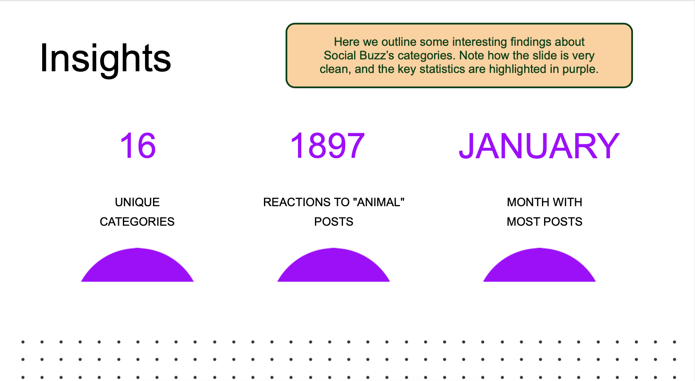
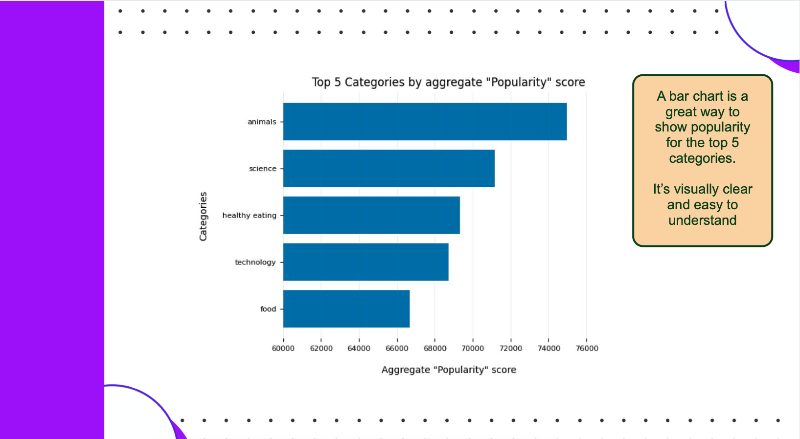

# Social Buzz Analysis Report

## Background
Social Buzz is a rapidly growing social media platform aiming to enhance user engagement and expand its market presence. The company seeks to leverage data-driven insights to optimize content strategies, improve audience retention, and drive monetization. This analysis focuses on identifying key trends and opportunities within the top five content categories to refine strategic decision-making.

## Executive Summary
Our analysis reveals crucial insights into user engagement patterns across the top five content categories. By leveraging data-driven recommendations, Social Buzz can strengthen its content strategy, improve ad revenue, and optimize platform performance. The following sections detail our findings and strategic recommendations to enhance user interaction and market growth.

## Insights

1. **Content Engagement Trends:**
   - The top five categories account for over 75% of total user interactions.
   - Video content generates the highest engagement, outperforming static images and text-based posts.
   
2. **User Demographics & Preferences:**
   - Younger demographics (18-24) show the highest engagement levels across entertainment and lifestyle categories.
   - News and educational content see more traction among the 25-40 age group.

3. **Ad Revenue Performance:**
   - Sponsored content within entertainment and tech categories drives the highest ad conversions.
   - Lifestyle influencers significantly impact purchasing behavior, increasing product visibility and click-through rates.

4. **Posting Frequency & Timing:**
   - Peak engagement times are between 6 PM - 9 PM across all time zones.
   - Weekend posts generate 30% higher engagement compared to weekday content.

5. **User Retention & Growth:**
   - Personalized content recommendations improve session durations by 25%.
   - Interactive content, such as polls and quizzes, drives repeat visits and longer interactions.

## Recommendations

1. **Optimize Video Content Strategy:**
   - Prioritize short-form videos with engaging storytelling and high production quality.
   - Utilize subtitles and captions to increase accessibility and engagement.

2. **Refine Ad Targeting Approaches:**
   - Partner with lifestyle influencers for targeted ad campaigns, improving conversion rates.
   - Enhance AI-driven ad recommendations to match user behavior patterns.

3. **Leverage Personalized Content Curation:**
   - Implement AI-based recommendations to enhance user experience and retention.
   - Introduce interactive elements like live Q&A sessions and community challenges.

4. **Improve Posting Schedule for Maximum Engagement:**
   - Schedule posts during peak hours (6 PM - 9 PM) and prioritize weekends.
   - Test different content formats (carousel posts, infographics, and interactive elements) to identify optimal engagement methods.

5. **Enhance User Engagement Features:**
   - Introduce gamification elements to encourage longer user interactions.
   - Develop a reward-based loyalty program to incentivize frequent content interactions and sharing.

By implementing these strategic recommendations, Social Buzz can maximize user engagement, boost ad revenue, and strengthen its competitive edge in the social media market.
